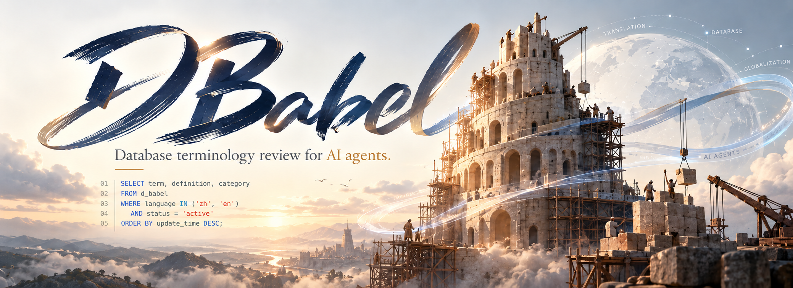
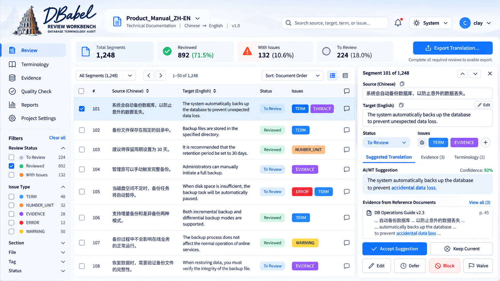

<p align="center">
  
</p>

# DBabel

**Database terminology review and technical-localization QA for AI agents.**

DBabel helps translators, technical writers, database teams, and AI agents use the
right term for the right product, version, text role, and context. Its name combines
**DB** (Database) with **Babel** (the Tower of Babel), reflecting the work of
connecting technical concepts across languages without flattening product-specific
meaning.

DBabel is deliberately data-light. It ships workflow logic, schemas, validators,
routing rules, synthetic tests, and optional format adapters; it does **not** ship a
vendor terminology corpus. Project glossaries and source material remain runtime
inputs owned or supplied by the user.

[中文说明](README.zh-CN.md) · [Skill kernel](SKILL.md) · [Package index](PACKAGE_INDEX.md) · [Examples](examples/)

## Review Workbench preview

<p align="center">
  
</p>

The DBabel Review Workbench provides a local human-in-the-loop interface for bilingual
technical review. It brings aligned source/target segments, terminology findings,
deterministic QA issues, supporting evidence, and suggested translations into a
single review surface.

Reviewers can inspect each segment, compare evidence and terminology context, and
record explicit decisions such as **Accept Suggestion**, **Keep Current**, **Edit**,
**Defer**, **Block**, or **Waive**. Review state, issue state, and QA state remain
separate so that an AI suggestion or detected issue is never treated as automatic
approval.

Before native export, the Workbench runs DBabel's export gate and fresh deterministic
QA. The current native write-back adapter supports **DOCX**, with original-file hash
validation, anchor checks, non-destructive output, and round-trip verification.
Portable review is also available for offline review and decision transfer.

## What DBabel is built on

DBabel is a repository-based **Agent Skill**, not a standalone machine-translation
engine or a bundled terminology database. Its architecture combines a compact Agent
kernel with progressive routing, evidence-based terminology adjudication,
deterministic QA, file preflight, and schema-driven validation.

| Layer | Uses | Purpose |
|---|---|---|
| Agent kernel | `SKILL.md` + Task Context | Keep only invariant rules in the always-loaded core |
| Progressive routing | Resource Router + Example Router | Load only the references and worked-example sections required by the current state |
| Evidence framework | Project-approved resources + authoritative runtime sources | Bind terminology decisions to product, version, text role, and evidence scope |
| Accuracy Core | Project glossary + deterministic bilingual QA | Detect repeatable integrity risks without pretending to make semantic judgments |
| Document preflight | Content-based format probe + capability/backend registry | Verify what a file actually is and whether a suitable parser is available before ingest |
| Ingest validation | Coverage and structure reporting | Separate "parser selected" from "content actually inspected" |
| Repair governance | Authorization + evidence + round-trip QA gates | Prevent a detected issue or proposed replacement from becoming an unverified edit |
| Package validation | JSON Schema + Python validators + regression tests + CI | Keep runtime, report, routing, version, and package contracts mutually consistent |

The design is provider-independent: an Agent, LLM, MT system, search tool, parser, or
format backend can be plugged in when available, but none of them becomes semantic
authority merely by being present. DBabel keeps the final terminology decision tied
to context and evidence.

The methodology is informed by terminology and localization standards such as ISO
704, TBX-related terminology models, W3C ITS 2.0, and OASIS XLIFF 2.1. These are
design references; DBabel does **not** claim TBX, TMX, or XLIFF compatibility unless
a dedicated adapter and conformance tests are implemented.

## Capabilities at a glance

| Capability | What DBabel does |
|---|---|
| Terminology lookup | Resolve a term against product, version, context, and supporting evidence |
| Document audit | Find terminology, scope, protected-token, and evidence issues with stable locations |
| Bilingual review | Compare aligned source/target units for terminology, omissions, numbers, placeholders, and protected content |
| Technical translation | Generate target text under project terminology and protected-token constraints, then recheck it |
| Project glossary governance | Validate JSON/CSV glossaries and enforce only scoped `PROJECT_APPROVED` entries |
| Deterministic QA | Check placeholders, URLs, paths, filenames, CLI options, environment variables, versions, numbers, units, and protected literals |
| Source research | Route unresolved or version-sensitive terminology to appropriate authoritative sources |
| Technical-claim routing | Separate terminology problems from unsupported performance, compatibility, licensing, or capability claims |
| Controlled repair | Apply only authorized, evidence-supported changes and verify the output with round-trip QA |
| Progressive instruction loading | Avoid loading every policy/reference/example when the current task does not need them |

## Format support

DBabel separates **format recognition**, **parser availability**, **ingest coverage**,
and **repair capability**. A file being recognized does not guarantee that every
structure in that file can be parsed or safely edited.

### Workflow-aware formats

| Format | Review/audit posture | Repair posture |
|---|---|---|
| DOCX | Structure-aware paragraphs, tables, headings, and other exposed Word structures | Conditional; preserve run-level formatting and non-target content |
| PPTX | Slides, shapes, tables, charts/notes when exposed | Conditional; requires layout/overflow recheck |
| XLSX | Cells, headers, tables, comments/notes when exposed; formulas protected | Conditional; formula-safe handling required |
| XLSM | Same as XLSX plus macro awareness | High-risk; macros must be preserved and generic repair may be blocked |
| HTML | DOM-aware visible text, metadata, attributes, links, code, scripts/styles | Conditional; preserve markup and bindings |
| Markdown | AST-aware handling when available; protect code, links, and front matter | Conditional |
| TXT | Text-only with reduced structural confidence | Conditional |
| PDF | Page/location-aware audit; read-only by default | Dedicated PDF workflow required |
| Image / UI screenshot | Vision/OCR candidate extraction with explicit uncertainty | Image-edit workflow required |

### Additional format awareness

The built-in bounded format probe can also recognize or classify common container
and data formats such as DOCM/PPTM, legacy OLE Office containers (`.doc/.xls/.ppt`),
ODT/ODS/ODP, EPUB, ZIP, JSON, XML, CSV, and common image signatures. Recognition is
only the first gate: actual parsing still depends on a compatible runtime backend.

Optional backends can extend detection or parsing, but they are registered rather
than auto-installed. DBabel's core remains usable with Python 3.9+ and the repository
validation dependencies only.

## Key design properties

- **Progressive** — route and load only what the current task state requires.
- **Fail-closed** — missing scope, format conflicts, unsupported repair paths, and
  ambiguous evidence remain explicit instead of being guessed through.
- **Data-light** — no bundled vendor terminology corpus or proprietary translation
  memory is required.
- **Scope-aware** — product, version, text role, and project approval remain part of
  the decision boundary.
- **Deterministic where possible, semantic where necessary** — mechanical integrity
  checks are repeatable, while meaning still requires contextual adjudication.
- **Auditable** — findings, evidence, coverage, repair actions, and QA states are
  represented as explicit contracts rather than implicit Agent claims.
- **Provider-independent** — optional parsers, search tools, MT systems, and LLMs can
  assist the workflow without owning the final terminology decision.

## How to use

### Codex

Ask Codex to install the complete skill folder:

```text
Install DBabel as a local Codex skill by cloning the complete repository:
https://github.com/golearnalanguage/DBabel
Destination: ~/.agents/skills/dbabel-database-terminology-audit
The entry point is SKILL.md at the repository root.
Keep all supporting directories alongside it.
```

Once the skill appears in the skill picker, attach your document or provide its
local path, then invoke it:

```text
$dbabel-database-terminology-audit Review the attached database manual's
English terminology. Use the product and version stated in the manual.
Return the location, suggested wording, reason, and source for each issue.
```

If it does not appear, start a new session or restart Codex. For manual installation
on macOS/Linux:

```bash
mkdir -p "$HOME/.agents/skills"
git clone https://github.com/golearnalanguage/DBabel.git \
  "$HOME/.agents/skills/dbabel-database-terminology-audit"
```

### Claude Code

```bash
mkdir -p "$HOME/.claude/skills"
git clone https://github.com/golearnalanguage/DBabel.git \
  "$HOME/.claude/skills/dbabel-database-terminology-audit"
```

Then invoke it in Claude Code, replacing the example path with your document:

```text
/dbabel-database-terminology-audit Review ./docs/database-manual.md for database terminology. Report each issue with its location, reason, and source.
```

### Other agents

For an agent that can read GitHub files, paste this prompt and attach your document:

```text
Use DBabel from https://github.com/golearnalanguage/DBabel to review the
attached document's database terminology.

First read https://raw.githubusercontent.com/golearnalanguage/DBabel/main/SKILL.md.
Follow its progressive-loading workflow: build the task context, preflight files
when applicable, route only the required resources, and avoid loading every
reference file by default. Return located findings with evidence, coverage, QA
actually performed, and unresolved questions.
```

For a local-only agent, download the [repository ZIP](https://github.com/golearnalanguage/DBabel/archive/refs/heads/main.zip),
extract it, and provide the complete folder together with your document and approved
references.

## Progressive runtime

DBabel's runtime is intentionally staged so an agent does not read every instruction
for every task.

```text
request
  -> task context
  -> file format/capability preflight when needed
  -> resource router
  -> load_now only
  -> ingest + coverage validation
  -> terminology / translation workflow
  -> deterministic QA when aligned units exist
  -> semantic adjudication
  -> repair gate when authorized
  -> round-trip QA
  -> output
```

A change in state can trigger re-routing. For example, deterministic bilingual QA is
not loaded before source/target units are aligned, repair rules are not loaded before
repair authorization, and public-search strategy is not loaded when an approved
scoped resource already resolves the question and no external verification was
requested.

See [agent integration](docs/AGENT_INTEGRATION.md),
[architecture](docs/ARCHITECTURE.md), and the
[local tooling guide](docs/LOCAL_TOOLING.md).

## Accuracy Core

The Accuracy Core provides deterministic checks that complement, but never replace,
semantic review.

It includes:

- a project-glossary schema and CSV template;
- JSON/CSV glossary validation and normalization;
- scope-aware enforcement of `PROJECT_APPROVED` entries only;
- protected-literal, placeholder, URL, path, filename, CLI-option, environment
  variable, version, number, and number/unit integrity checks;
- deterministic bilingual QA reports classified as `POTENTIAL_ISSUE`.

Validate a project glossary:

```bash
python scripts/validate_glossary.py project_glossary.csv
```

Run deterministic QA on already aligned units:

```bash
python scripts/check_bilingual_integrity.py \
  bilingual_units.jsonl \
  --glossary project_glossary.csv \
  --output qa_report.json
```

A deterministic issue is **not** evidence, a semantic error verdict, confidence, or
repair authorization. DBabel still requires context, evidence, and adjudication for
material terminology decisions.

## File preflight and optional backends

For file tasks, DBabel separates four claims that are often conflated:

```text
extension claim
!= verified content format
!= parser availability
!= successful/full ingest
```

The built-in format probe is standard-library only and performs bounded,
non-executing inspection. It can distinguish common signatures and containers,
including OOXML families and macro-enabled Office packages. Extension/content
conflicts fail closed rather than silently choosing a parser.

Example runtime preflight:

```bash
python scripts/prepare_runtime.py \
  --mode AUDIT \
  --file ./docs/manual.docx \
  --declare-backend native_agent \
  --output runtime-plan.json
```

After actual parsing, validate what was really covered rather than treating
preflight as ingest success:

```bash
python scripts/validate_ingest.py ingest-report.json
```

Optional detector/parser backends are registered but not installed automatically.
See [format backends](plugins/FORMAT_BACKENDS.md) before adding dependencies.

## Common tasks

After installing in Codex, use one of these prompts. In Claude Code, replace the
leading `$` with `/`.

**Check a term**

```text
$dbabel-database-terminology-audit Check whether “schema” is used correctly
in this PostgreSQL 17 paragraph: [paste paragraph]. Explain the concept and cite
the relevant official documentation.
```

**Review a translation**

```text
$dbabel-database-terminology-audit Compare the attached Chinese source and
English translation. Check database terms, product names, abbreviations, and
technical tokens. Report source/target locations and suggested corrections.
```

**Translate and verify**

```text
$dbabel-database-terminology-audit Translate ./docs/manual-zh.md into English
using ./docs/project-glossary.csv. Preserve SQL, configuration keys, paths, and
product names. Save a new file and report terminology that still needs review.
```

**Repair a document**

```text
$dbabel-database-terminology-audit Review ./docs/database-manual.md and apply
well-supported terminology corrections to a new copy. Reopen the result, check
protected tokens and non-target content, and return the file and change log.
```

## How review works

The semantic decision vocabulary remains deliberately small:

| Decision | Result |
|---|---|
| `KEEP` | Keep the wording in this context |
| `REPLACE` | Recommend a specific, evidenced correction |
| `PROTECT` | Preserve an exact name or technical token |
| `REVIEW` | Identify the evidence or context still needed |
| `OUT_OF_SCOPE_CLAIM` | Route a factual claim for separate verification |

DBabel uses approved project resources within their scope and authoritative sources
retrieved when necessary. It does not infer cross-vendor equivalence from similar
functionality. Document coverage and repair support depend on the available runtime
capabilities and the structures actually inspected.

## Validation

Repository version: **1.4.0**. See [changes](CHANGELOG.md) and
[report format](references/11_OUTPUT_AND_DATA_CONTRACTS.md).

Local validation requires Python 3.9+ and the development dependencies:

```bash
python3 -m venv .venv
.venv/bin/python -m pip install -r requirements-dev.txt
.venv/bin/python scripts/check_package.py
.venv/bin/python -m unittest discover -s tests -v
.venv/bin/python scripts/validate_report.py examples/audit_report.json
.venv/bin/python scripts/validate_glossary.py tests/fixtures/project_glossary.json
.venv/bin/python scripts/validate_glossary.py tests/fixtures/project_glossary.csv
.venv/bin/python scripts/check_bilingual_integrity.py \
  tests/fixtures/bilingual_units.jsonl \
  --glossary tests/fixtures/project_glossary.json \
  --output /tmp/dbabel-qa.json
```

Package validation checks schemas, links, evidence/repair contracts, regression
behavior, and package integrity. Passing local validators does not establish source
truth or complete document coverage; those claims remain part of the agent/runtime
workflow.

## License and contributions

DBabel is available under the [PolyForm Noncommercial License 1.0.0](LICENSE).
See [contributing](CONTRIBUTING.md) for workflow, schema, and test improvements.

Installation conventions follow the official [Codex skill guide](https://learn.chatgpt.com/docs/build-skills)
and [Claude Code skill guide](https://code.claude.com/docs/en/skills).
