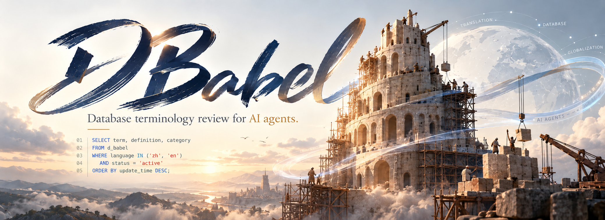
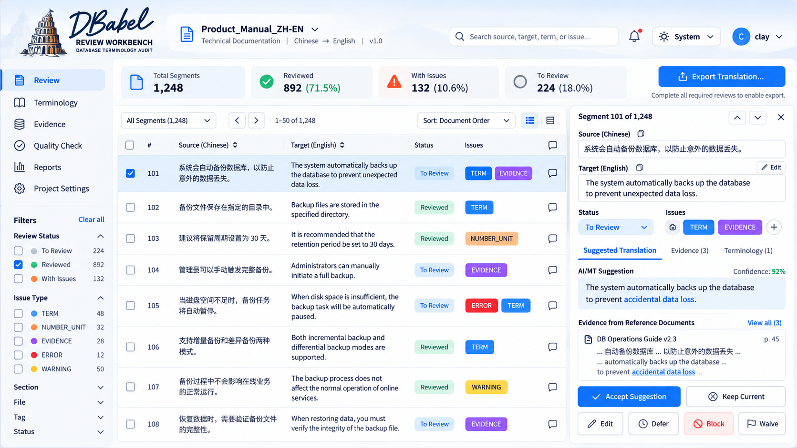

<p align="center">
  
</p>

# DBabel

<p align="center">
  <a href="https://github.com/golearnalanguage/DBabel/actions/workflows/validate.yml"></a>
  <a href="https://github.com/golearnalanguage/DBabel/releases"></a>
  <a href="LICENSE"></a>
  
</p>

**Database terminology review and bilingual quality checks for AI agents.**

DBabel helps reviewers check technical translations against the right product, version and context. An Agent prepares located findings, evidence and suggested wording; a human reviews the changes in a local workbench. Reviewed DOCX, TXT, Markdown and anchored XLSX copies are exported with integrity checks, an audit receipt, bilingual comparison and Agent handoff.

DBabel supplies the review workflow, local tools and document adapters. You provide documents and scoped reference material; your Agent generates translations and evaluates evidence. The Workbench records human decisions and checks their outputs.

[中文说明](README.zh-CN.md) · [Workflow guide](docs/WORKFLOW_GUIDE.md) · [Agent entry point](SKILL.md) · [Case index](examples/technical_translation_review_examples.md)

<p align="center"></p>

## Review Workbench

<p align="center"></p>

Read the source and target side by side, inspect the supporting evidence, then **Accept Suggestion**, **Keep Current**, **Edit**, **Defer**, **Block**, or **Waive**. AI suggestions, potential issues and human decisions remain separate.

- **Choose the interface language:** switch between English and Simplified Chinese; source text and reviewer notes stay verbatim.
- **Understand each suggestion:** inspect a proposed translation with its reason, or a concrete revision checklist when no replacement is supplied.
- **Focus the review:** filter by status, issue type, location or tag. Select a page or all matching segments for an explicit bulk Keep Current / Defer decision.
- **Export the translated layout:** Draft replaces every anchored text unit with an approved edit or pending suggestion in a new file of the original format; its receipt marks pending review. Checkpoint applies only reviewed changes, while Final requires the full review gate.
- **Check human edits:** download an Agent handoff from Reports to check typos, mistaken wording and omissions. Suggestions return to human review; downloading the report does not run an LLM.
- **Review offline:** a self-contained Portable Review file exports decisions for import into the matching local session and fresh QA.

Use **Upload documents** to inspect and import TXT, Markdown, CSV/TSV, JSON/JSONL, HTML, DOCX, XLSX, PPTX or text-layer PDF. Set one or several target languages, then review each language separately. **Terminology → Upload project glossary** validates CSV/JSON project terms and reports scoped terminology compliance.

All local sessions, including the demo and review-only sessions, export **JSON, CSV, TSV, Markdown, HTML and TXT** review results. Original-format delivery supports **DOCX, TXT, Markdown and anchored XLSX**, with a receipt, bilingual HTML and Markdown/JSON Agent handoff. See [format dependencies and fidelity](docs/DOCUMENT_FORMATS.md).

## The Babel App Now is available on GitHub

The [DBabel macOS App release](https://github.com/golearnalanguage/DBabel/releases/tag/v1.6.0) provides a self-contained Apple Silicon disk image. Drag **DBabel.app** into Applications, then choose **AI translation** to configure an OpenAI-compatible service and translate a document, or **Local bilingual review** to upload documents, open the demo, and resume a saved session. The Workbench saves review decisions and in-progress translation or note drafts locally; its right-hand chat can use the same configured API service. Downloaded review results include the source filename. See the [desktop guide](docs/DESKTOP_APP.md) for installation, format support, and export steps.

New in **1.6.0**: streaming and protocol selection for Chat Completions (including NewAPI gateways), Responses and Claude Messages; smaller-batch recovery for interrupted requests; configurable timeouts and model options; local translation memory and opt-in database terms. Portable Review adds cached draft recovery, explicit current/suggested acceptance, edit confirmation, resizable details and navigation that follows the selected segment. The Skill routes detailed procedures by stage instead of loading the full workflow into every call. Read [API compatibility](docs/PROVIDER_COMPATIBILITY.md) and [local memory](docs/LOCAL_PRECHECK_AND_MEMORY.md).

## Workflow

| Step | Action | Next handoff |
|---|---|---|
| Prepare | Declare task scope, languages, resources and permission to repair | Task context and resource plan |
| Ingest | Check the real format, parser capability, extracted coverage and alignment | Located source/target units |
| Diagnose | Run applicable integrity checks, assess semantics and inspect evidence | Findings and suggested wording |
| Review | Record explicit human decisions in the Workbench | Reviewed targets and pending scope |
| Recheck | Review human edits for spelling and word misuse, then rerun QA | New suggestions for human confirmation |
| Deliver | Export a checkpoint or final DOCX/TXT/Markdown/XLSX copy and verify the result | Document, receipt, bilingual view and Agent handoff |

Load only resources needed for the current step. The [18 worked cases](examples/technical_translation_review_examples.zh-CN.md) are split into individual files across five problem categories. The router returns exact `example_files`; examples are diagnostic patterns, never evidence for the current document.

## Start a local review

Python 3.9+. First enter your downloaded DBabel directory (replace this example path on another computer):

```bash
cd /Users/eric/Downloads/DBabel-submit
python3 -m venv .venv
.venv/bin/python -m pip install -r requirements-dev.txt
.venv/bin/python scripts/start_local.py
```

The launcher creates a separate demo copy once, then resumes it. For a real document, open **Upload documents**, inspect the scope and create a session. On macOS, the [native desktop app](docs/DESKTOP_APP.md) opens the same local Workbench in a continuous system-material window; its demo and saved sessions use the same appearance. The [local walkthrough](docs/WORKFLOW_GUIDE.md) covers offline use, starting from any directory, translation proposals, terminology, QA and delivery. The [documentation index](docs/INDEX.md) links separate English and Chinese manuals.

For an existing DOCX translation, prepare aligned units with `scripts/create_review_session.py`, then launch with `--original target.docx --output reviewed.docx`. The [Workbench manual](docs/REVIEW_WORKBENCH.md) describes native export and portable review.

## Use with an Agent

### Codex

Ask Codex to install the complete skill folder:

```text
Install DBabel as a local Codex skill by cloning the complete repository:
https://github.com/golearnalanguage/DBabel
Destination: ~/.agents/skills/dbabel-database-terminology-audit
The entry point is SKILL.md at the repository root.
Keep all supporting directories alongside it.
```

Once the skill appears in the skill picker, attach your document or provide its
local path, then invoke it:

```text
$dbabel-database-terminology-audit Review the attached database manual's
English terminology. Use the product and version stated in the manual.
Return the location, suggested wording, reason, and source for each issue.
```

If it does not appear, start a new session or restart Codex. For manual installation
on macOS/Linux:

```bash
mkdir -p "$HOME/.agents/skills"
git clone https://github.com/golearnalanguage/DBabel.git \
  "$HOME/.agents/skills/dbabel-database-terminology-audit"
```

### Claude Code

```bash
mkdir -p "$HOME/.claude/skills"
git clone https://github.com/golearnalanguage/DBabel.git \
  "$HOME/.claude/skills/dbabel-database-terminology-audit"
```

Then invoke it in Claude Code, replacing the example path with your document:

```text
/dbabel-database-terminology-audit Review ./docs/database-manual.md for database terminology. Report each issue with its location, reason, and source.
```

### Other agents

For an agent that can read GitHub files, paste this prompt and attach your document:

```text
Use DBabel from https://github.com/golearnalanguage/DBabel to review the
attached document's database terminology.

First read https://raw.githubusercontent.com/golearnalanguage/DBabel/main/SKILL.md.
Follow its progressive-loading workflow: build the task context, preflight files
when applicable, route only the required resources, and avoid loading every
reference file by default. Return located findings with evidence, coverage, QA
actually performed, and unresolved questions.
```

For a local-only agent, download the [repository ZIP](https://github.com/golearnalanguage/DBabel/archive/refs/heads/main.zip),
extract it, and provide the complete folder together with your document and approved
references.

## Review and delivery rules

- Check terminology, bilingual meaning, protected tokens and scoped project wording. Keep executable SQL and identifiers intact during language review.
- Deterministic QA checks placeholders, paths, URLs, numbers, units and other literal content. A `POTENTIAL_ISSUE` requires interpretation; a passing check is not semantic approval.
- Preserve product/version distinctions and uncertainty. Evidence must support the actual claim and scope.
- Native export checks the original hash, changed text anchors and round-trip text integrity. It writes a new copy and preserves non-target text. Visual layout review remains a separate check.
- Agent reports disclose inspected scope, unresolved items and unavailable checks. Use the DBabel JSON/CSV contracts for interchange; TBX, TMX and XLIFF require separate adapters.

## Development and reference

Repository version: **1.6.0**. Review Workbench version: **1.6.0**. Repository changes are recorded in [Changes](CHANGELOG.md); the macOS App has a separate [download release](https://github.com/golearnalanguage/DBabel/releases/tag/v1.6.0).

```bash
python -m py_compile scripts/*.py
python -m unittest discover -s tests -v
python scripts/check_package.py
```

After intentional package edits, regenerate `MANIFEST.sha256` with `python scripts/check_package.py --write-manifest`, rerun validation and check `git diff --check`.

[Architecture](docs/ARCHITECTURE.md) · [Local tools](docs/LOCAL_TOOLING.md) · [Capabilities](docs/AGENT_CAPABILITY_MATRIX.md) · [Post-review QA](docs/POST_REVIEW_QA.md) · [Package index](PACKAGE_INDEX.md) · [License](LICENSE)
